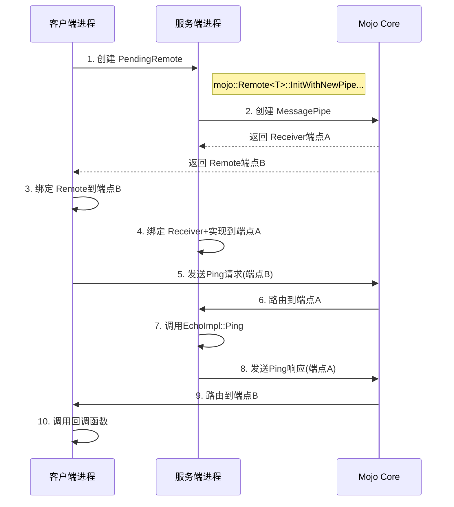

好的，我帮你整理成完整的 **Markdown 格式文档**，方便阅读和使用：

---

# Mojo 接口绑定原理详解与实例说明

Mojo 接口绑定是 Mojo IPC 系统的核心机制，它通过代码生成和运行时支持来实现跨进程通信的抽象。本文将详细解析其原理，并通过示例说明。

---

## 一、核心绑定原理

### 1. 三要素模型

每个 Mojo 接口绑定涉及三个核心组件：

1. **接口定义 (Interface)**：`.mojom` 文件中定义的 RPC 契约
2. **实现端 (Implementation)**：服务端的具体业务逻辑
3. **代理端 (Proxy)**：客户端的调用抽象

### 2. 双向绑定流程


### 3. 关键绑定对象

* **PendingReceiver<T>**：等待绑定的服务端端点（管道接收端）
* **PendingRemote<T>**：等待绑定的客户端端点（管道发送端）
* **Receiver<T>**：绑定具体实现到管道的服务端控制器
* **Remote<T>**：绑定代理到管道的客户端控制器

---

## 二、完整代码示例

### 1. 定义 mojom 接口 (echo.mojom)

```mojom
module demo.mojom;

interface Echo {
    Ping() => (string response);
    Repeat(string input, int32 times) => (string output);
    GetStatus() => (int32 requestCount, bool isActive);
};
```

### 2. 生成绑定代码 (BUILD.gn)

```gn
import("//mojo/public/tools/bindings/mojom.gni")

mojom("echo") {
  sources = [ "echo.mojom" ]
}
```

生成文件：

* `echo.mojom.h`（接口定义）
* `echo.mojom.cc`（序列化逻辑）
* `echo.mojom-shared.h`（共享类型）
* `echo.mojom-blink.h`（Blink 特殊化）
* `echo.mojom-js`（JS绑定）

---

### 3. 服务端实现 (echo\_service\_impl.h)

```cpp
#include "demo/echo.mojom.h"

class EchoServiceImpl : public demo::mojom::Echo {
public:
  explicit EchoServiceImpl() = default;

  void Ping(PingCallback callback) override {
    ++request_count_;
    std::move(callback).Run("Pong from PID: " + base::NumberToString(base::GetCurrentProcId()));
  }

  void Repeat(const std::string& input, int32_t times, RepeatCallback callback) override {
    ++request_count_;
    std::string result;
    for (int i = 0; i < times; ++i) {
      result += input + " ";
    }
    std::move(callback).Run(result);
  }

  void GetStatus(GetStatusCallback callback) override {
    std::move(callback).Run(request_count_, true);
  }

private:
  int32_t request_count_ = 0;
};
```

---

### 4. 服务端绑定 (echo\_service\_main.cc)

```cpp
std::unique_ptr<mojo::Receiver<demo::mojom::Echo>> CreateAndBindService() {
  auto service = std::make_unique<EchoServiceImpl>();

  mojo::PendingRemote<demo::mojom::Echo> remote;
  auto receiver = std::make_unique<mojo::Receiver<demo::mojom::Echo>>(
      service.get(), remote.InitWithNewPipeAndPassReceiver());

  PassRemoteToClient(std::move(remote));
  return receiver;
}
```

---

### 5. 客户端绑定与调用 (echo\_client.cc)

```cpp
void UseEchoService() {
  mojo::Remote<demo::mojom::Echo> echo_remote = GetEchoRemoteFromService();

  echo_remote.set_disconnect_handler(base::BindOnce([] {
    LOG(ERROR) << "Echo service disconnected!";
  }));

  echo_remote->Ping(base::BindOnce([](const std::string& response) {
    LOG(INFO) << "Received: " << response;
  }));

  echo_remote->Repeat("Hello", 3, base::BindOnce([](const std::string& result) {
    LOG(INFO) << "Repeated: " << result; // 输出 "Hello Hello Hello "
  }));

  echo_remote->GetStatus(base::BindOnce([](int32_t count, bool active) {
    LOG(INFO) << "Service handled " << count << " requests, active: " << active;
  }));
}
```

---

## 三、绑定工作原理解析

### 1. 管道建立时序图



### 2. 方法调用深度解析

#### 代理层 (Proxy)

```cpp
void EchoProxy::Ping(PingCallback callback) {
  uint64_t request_id = next_request_id_++;
  mojo::Message message(internal::kEcho_Ping_Name, kMessageExpectsResponse, kMessageIsSync);
  internal::Echo_Ping_Params_Data params;
  params.header.request_id = request_id;
  message.Serialize(&params);
  pending_callbacks_[request_id] = std::move(callback);
  proxy_.SendMessage(&message);
}
```

#### 桩层 (Stub)

```cpp
bool EchoStub::Accept(mojo::Message* message) {
  switch (message->header()->name) {
    case internal::kEcho_Ping_Name: {
      internal::Echo_Ping_Params_Data* params =
          reinterpret_cast<internal::Echo_Ping_Params_Data*>(message->payload());
      auto responder = Echo_Ping_ResponseType::Create(request_id);
      impl_->Ping(base::BindOnce(&Echo_Ping_ResponseType::Run, std::move(responder)));
      return true;
    }
  }
}
```

#### 响应返回

```cpp
void Echo_Ping_ResponseType::Run(const std::string& response) {
  mojo::Message message(internal::kEcho_Ping_ResponseName, kMessageIsResponse);
  internal::Echo_Ping_ResponseParams_Data params;
  params.response = response;
  message.Serialize(&params);
  responder_->SendResponse(&message);
}
```

---

## 四、高级绑定特性

1. **关联接口 (Associated Interfaces)**

```mojom
interface Logger {
  Log(string message);
}

interface Echo {
  GetLogger() => (Logger logger);
}
```

客户端使用：

```cpp
echo_remote->GetLogger(base::BindOnce([](mojo::PendingRemote<demo::mojom::Logger> logger) {
  logger_remote.Bind(std::move(logger));
  logger_remote->Log("Client started");
}));
```

2. **同步调用**

```mojom
interface FastEcho {
  [Sync]
  string EchoSync(string input);
}

// 客户端调用
std::string output;
fast_echo->EchoSync("Test", &output);  // 阻塞调用
```

3. **接口版本控制**

```mojom
interface FileReader {
  [MinVersion=1] Read(int32 offset);
  [MinVersion=2] ReadAsync(int32 offset) => (bytes data);

  enum {
    kReadDeprecated = 0,
    kReadAsync = 1,
  };
}
```

---

## 五、实际应用场景

### 1. Chromium 浏览器中的绑定

```cpp
// 浏览器进程
void RenderProcessHostImpl::BindReceiver(
    mojo::PendingReceiver<blink::mojom::BrowserInterfaceBroker> receiver) {
  broker_receiver_.Bind(std::move(receiver));
}

// 渲染进程
frame_->GetBrowserInterfaceBroker().GetInterface(
    mojo::MakePendingReceiver<content::mojom::Renderer>(...));
```

### 2. 跨进程资源加载

```cpp
mojo::Remote<network::mojom::URLLoaderFactory> factory_remote;
render_frame_host_->GetRemoteAssociatedInterfaces()->GetInterface(&factory_remote);

factory_remote->CreateLoaderAndStart(
    std::move(pending_loader), request_id, options, request,
    std::move(client), traffic_annotation);
```

---

## 六、性能优化机制

1. **零拷贝传输**

```cpp
mojo::ScopedSharedBufferHandle buffer = mojo::SharedBufferHandle::Create(4096);
mojo::ScopedSharedBufferMapping mapping = buffer->Map(4096);
memcpy(mapping.get(), data, size);
file_reader_remote->SendLargeData(std::move(buffer));
```

2. **批处理与流水线**

```cpp
for (int i = 0; i < 100; i++) {
  echo_remote->Ping(...); // 实际批量发送
}
```

3. **流量控制**

```cpp
mojo::SimpleWatcher watcher;
watcher.Watch(handle_.get(), MOJO_HANDLE_SIGNAL_READABLE,
              base::BindRepeating(&OnReadable));
handle_watcher_.ArmOrNotify();
```

---

## 七、安全机制

1. **能力控制**

```cpp
mojo::Message message;
if (!message.HasCapability(kRequiredCapability)) {
  ReportBadMessage("Missing required capability");
  return;
}
```

2. **消息验证**

```cpp
bool EchoStub::Accept(mojo::Message* message) {
  if (!ValidatePayloadSize(message))
    return false;
}
```

3. **沙箱 IPC 代理**

```cpp
SandboxIPC::MessageCall call;
sandbox_ipc_->PostTask(FROM_HERE, base::BindOnce(
    &SandboxIPC::HandleMessage, base::Unretained(sandbox_ipc_), call));
```

---

## 八、总结

Mojo 接口绑定核心精髓：

1. 接口契约驱动：`.mojom` 文件定义通信契约
2. 代码自动生成：类型安全的代理/桩代码
3. 运行时绑定：Receiver/Remote 与管道关联
4. 异步通信模型：基于回调的非阻塞调用
5. 高性能传输：共享内存 + 批处理优化
6. 严格安全边界：能力模型 + 消息验证

特点：

* 跨进程调用如同本地方法调用
* 编译器检查类型安全
* 透明异步通信
* 底层数据传输优化
* 严格安全边界控制

在 Chromium 架构中，Mojo 绑定是连接浏览器、渲染器、GPU、插件等进程的核心纽带，支撑多进程架构的高效安全运行。

---
