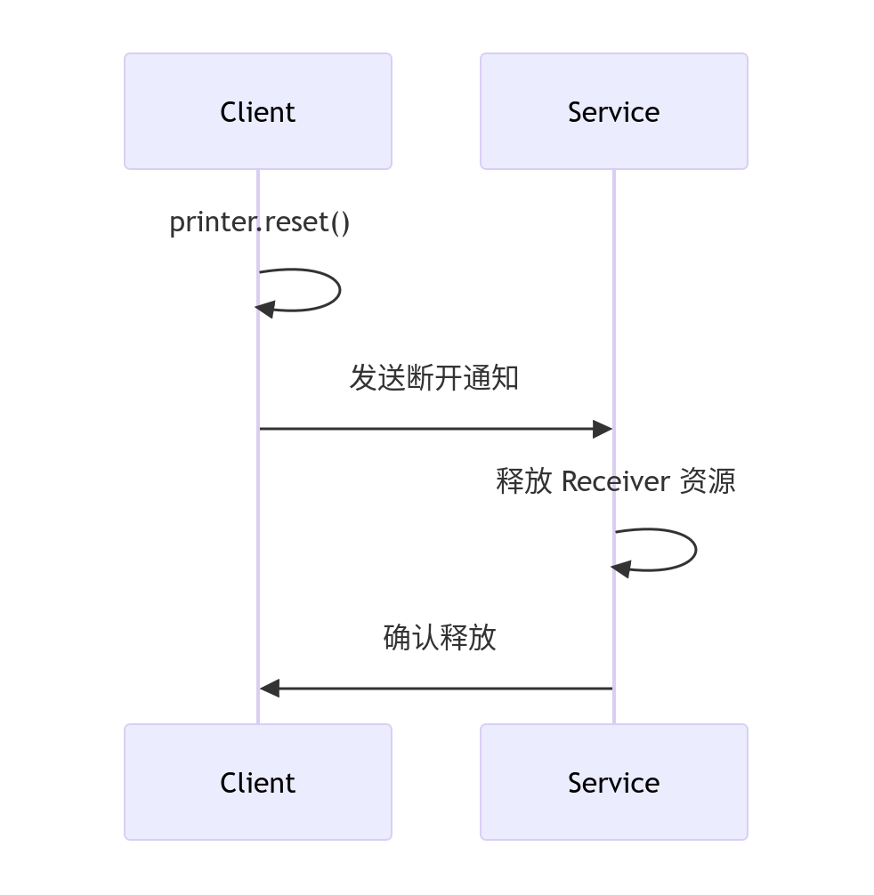

好的 ✅，我帮你把 **Mojo IPC 中 Remote 和 Receiver 的连接与通信流程分析** 转换为 **Markdown 文档**，结构清晰、带时序图。

---

# Mojo IPC 中 Remote 和 Receiver 连接与通信流程分析

## 1. 连接建立流程


**关键步骤：**

1. 客户端初始化：

```cpp
mojo::Remote<mojom::Printer> printer;
```

2. 管道创建：

```cpp
auto receiver = printer.BindNewPipeAndPassReceiver();
```

3. 服务端绑定：

```cpp
PrinterImpl printer_impl;
mojo::Receiver<mojom::Printer> receiver(&printer_impl, std::move(receiver));
```

---

## 2. 通信流程


**详细步骤：**

1. 客户端发起调用：

```cpp
printer->PrintDocument(data, base::BindOnce(&OnPrintComplete));
```

2. 参数序列化：

* `Remote` 自动序列化参数为 Mojo 消息
* 通过消息管道发送

3. 服务端接收处理：

```cpp
void PrinterImpl::PrintDocument(const Data& data, PrintDocumentCallback callback) {
    // 实际打印逻辑
    std::move(callback).Run(result);
}
```

4. 响应返回：

* `Receiver` 自动序列化响应并返回给 `Remote`

5. 客户端执行回调：

```cpp
void OnPrintComplete(PrintResult result) {
    // 处理打印结果
}
```

---

## 3. 连接断开处理


**断开处理示例：**

```cpp
// 客户端设置断开处理
printer.set_disconnect_handler(base::BindOnce(&HandlePrinterDisconnect));

void HandlePrinterDisconnect() {
    LOG(ERROR) << "打印机服务断开连接";
    ReconnectPrinter(); // 重新连接逻辑
}
```

---

## 4. 高级通信控制

### 版本协商


### 流量控制

```cpp
// 客户端暂停服务端
auto flush = printer.FlushAsync();
printer.PauseReceiverUntilFlushCompletes(std::move(flush));

// 服务端刷新响应
receiver.FlushAsync();
```

---

## 5. 错误处理机制

**客户端错误处理：**

```cpp
printer.set_disconnect_with_reason_handler(
    [](uint32_t reason, const std::string& description) {
        LOG(ERROR) << "断开原因: " << reason << ", 描述: " << description;
    });
```

**服务端错误报告：**

```cpp
void PrinterImpl::ProcessRequest(const Params& params) {
    if (!ValidateParams(params)) {
        receiver_.ReportBadMessage("无效参数");
        return;
    }
    // 正常处理
}
```

---

## 6. 生命周期管理



**安全释放保证：**

* `Remote` 析构：自动取消所有未完成回调
* `Receiver` 析构：释放所有资源
* 跨进程引用计数：自动管理生命周期

---

## 7. 跨进程通信优化

**零拷贝传输：**

```cpp
// 使用共享内存传输大文件
printer->PrintLargeFile(mojo::WrapSharedMemoryHandle(shared_memory));
```

**批处理优化：**

```cpp
// 启用消息批处理
printer.EnableBatchMode();
for (int i = 0; i < 100; i++) {
    printer->PrintPage(page_data[i]);
}
printer.FlushAsync(); // 一次性发送
```

---

## 8. 安全机制

**消息验证：**

```cpp
// 服务端消息过滤器
receiver.SetFilter(std::make_unique<SecurityFilter>());

class SecurityFilter : public mojo::MessageFilter {
    bool WillDispatch(mojo::Message* message) override {
        return ValidateMessage(*message); // 安全验证
    }
};
```

**权限控制：**

```cpp
void PrinterImpl::PrintDocument(...) {
    if (!CheckPermission(user_id)) {
        receiver_.ResetWithReason(ERROR_PERMISSION_DENIED, "无权限");
        return;
    }
    // ...
}
```

---

## 总结：Mojo IPC 通信全流程

1. **连接建立**

   * 客户端创建 `Remote`
   * 服务端创建 `Receiver` 并绑定实现
   * 管道建立完成

2. **请求处理**

   * 客户端调用接口方法
   * 参数序列化传输
   * 服务端执行逻辑并返回响应

3. **高级控制**

   * 版本协商
   * 流量控制
   * 错误处理

4. **资源管理**

   * 自动生命周期管理
   * 安全释放
   * 引用计数

5. **性能优化**

   * 零拷贝传输
   * 批处理减少开销
   * 异步非阻塞

6. **安全保障**

   * 消息验证
   * 权限控制
   * 安全过滤

通过这些机制，**Mojo 提供了高效、安全、可靠的跨进程通信能力**，是 Chromium 网络与多进程架构的核心基础设施。

