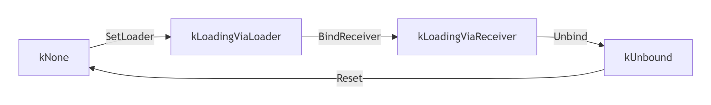
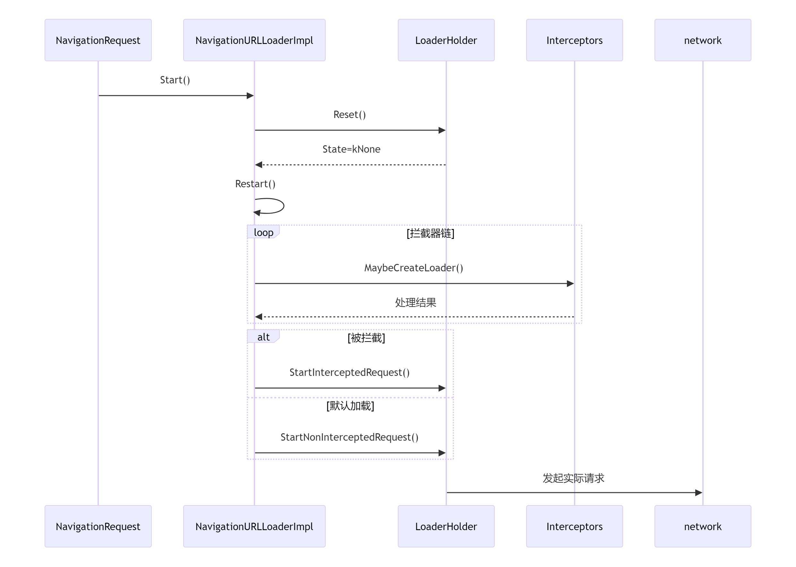
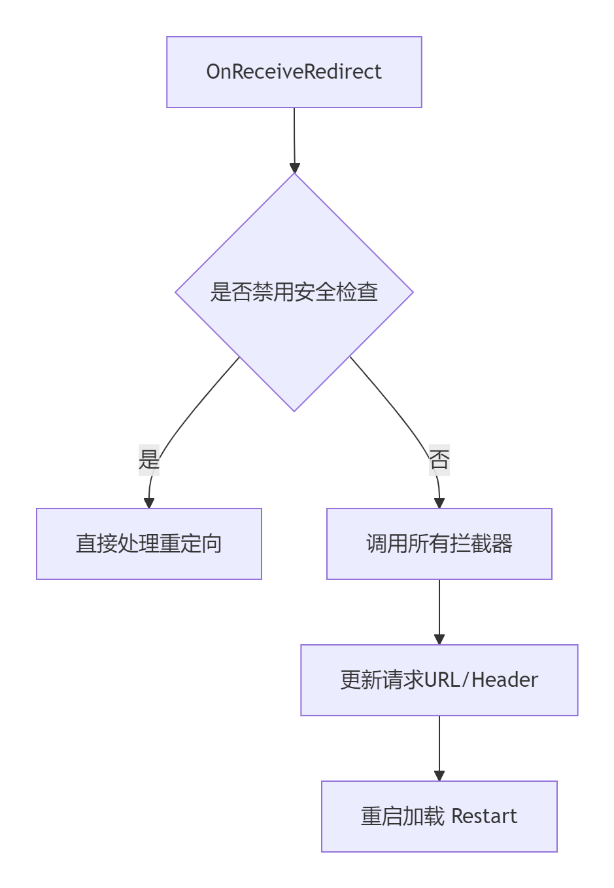

# NavigationURLLoaderImpl 类深度解析

## 核心设计思想

`NavigationURLLoaderImpl` 是 **Chromium 导航加载流程的核心协调器**，主要负责 **主框架导航的资源加载**。其设计基于四个核心原则：

1. **模块化拦截机制**

   * 通过 `NavigationLoaderInterceptor` 实现多层拦截
   * 支持 `Service Worker / AppCache / WebBundle` 等场景
   * `interceptors_` 链式调用实现优先级控制

2. **状态安全边界**

   * `LoaderHolder` 内部类管理加载状态机
   * 四种状态：`kNone → kLoadingViaLoader → kLoadingViaReceiver → kUnbound`
   * 使用独占任务（`ExclusiveTaskType`）确保异步操作原子性

3. **多协议统一处理**

   * 网络/非网络协议统一接口（`network://`, `blob://`, `file://` 等）
   * 按协议缓存工厂：`non_network_url_loader_factories_`
   * 未知协议通过 `CreateTerminalNonNetworkLoaderFactory()` 安全降级

4. **性能可观测性**

   * UKM 监控（`RecordReceivedResponseUkmForOutermostMainFrame()`）
   * 客户端提示（`OnAcceptCHFrameReceived()`）
   * 精确超时控制（`timeout_timer_`）

---

## 关键成员分析

### 核心资源管理器

| 成员                  | 类型                                     | 作用             |
| ------------------- | -------------------------------------- | -------------- |
| `delegate_`         | `NavigationURLLoaderDelegate*`         | 导航事件回调接口       |
| `resource_request_` | `unique_ptr<network::ResourceRequest>` | 当前网络请求对象       |
| `request_info_`     | `unique_ptr<NavigationRequestInfo>`    | 导航元数据（安全凭据/策略） |
| `url_`              | `GURL`                                 | 当前导航 URL（动态更新） |

---

### 协议工厂系统

```cpp
std::map<std::string, scoped_refptr<network::SharedURLLoaderFactory>> 
    non_network_url_loader_factories_;
```

* **工作机制**：按协议名缓存加载器工厂（如 `blob://`, `file://`）
* **优化点**：避免重复创建协议处理器
* **特殊处理**：`CreateTerminalNonNetworkLoaderFactory()` 处理未知协议

---

### 拦截器管理系统

```cpp
std::vector<std::unique_ptr<NavigationLoaderInterceptor>> interceptors_;
```

* **装载时机**：构造函数通过 `initial_interceptors` 注入
* **处理顺序**：`MaybeStartLoader()` 顺序调用拦截器
* **典型拦截器**：

  * Service Worker
  * SignedHTTPExchange
  * DevTools 网络拦截

---

### 加载状态机 (LoaderHolder)

```cpp
class LoaderHolder {
  enum class State {
    kNone,              // 无活动加载器
    kLoadingViaLoader,  // 使用 ThrottlingURLLoader
    kLoadingViaReceiver,// 使用 mojo 接口
    kUnbound            // 结束状态
  };
};
```

#### 状态转换图



---

### 性能监控系统

| 成员                                                 | 作用           |
| -------------------------------------------------- | ------------ |
| `ukm_source_id_`                                   | 导航关联的 UKM ID |
| `loader_creation_time_`                            | 加载器创建时间戳     |
| `RecordReceivedResponseUkmForOutermostMainFrame()` | 主框架响应监控      |

---

## 关键接口分析

### 导航控制接口

```cpp
// 启动导航
void Start() override;

// 重定向
void FollowRedirect(...) override;

// 超时控制
bool SetNavigationTimeout(base::TimeDelta timeout) override;
void CancelNavigationTimeout() override;
```

---

### 加载流程协调器

```cpp
// 重定向处理
void Restart();

// 拦截器决策
void MaybeStartLoader(...);

// 网络 / 非网络协议分流
void StartInterceptedRequest(...);
void StartNonInterceptedRequest(...);
```

---

### 客户端响应处理

```cpp
// 处理客户端提示帧
void OnAcceptCHFrameReceived(...) override;

// 响应头解析
void ParseHeaders(...);
```

---

### 资源拦截处理

```cpp
// 创建响应加载器
bool MaybeCreateLoaderForResponse(...);

// Service Worker 回退
static network::mojom::URLLoaderFactory* 
FallbackToNonInterceptedRequest(...);
```

---

## 设计亮点解析

### 1. 安全状态边界 (LoaderHolder)

```cpp
DUMP_WILL_BE_CHECK(state_ == State::kLoadingViaLoader)
    << "Unexpected state: " << static_cast<int>(state_);
```

* 原子操作：独占任务保障
* 状态隔离：避免资源访问冲突
* 异常处理：`ResetForFailure()` 强制终止

---

### 2. 多协议统一加载

```cpp
scoped_refptr<network::SharedURLLoaderFactory>
GetOrCreateNonNetworkLoaderFactory() {
  auto it = non_network_url_loader_factories_.find(scheme);
  if (it != non_network_url_loader_factories_.end())
    return it->second; // 缓存命中
  
  auto factory = CreateNonNetworkLoaderFactory(...);
  return non_network_url_loader_factories_[scheme] = factory;
}
```

* 缓存减少重复开销
* 动态扩展新协议
* 安全处理未知协议

---

### 3. 拦截器链式调用

```cpp
void MaybeStartLoader(size_t next_interceptor_index, ...) {
  if (next_interceptor_index >= interceptors_.size()) {
    StartNonInterceptedRequest(...);
    return;
  }
  
  auto* interceptor = interceptors_[next_interceptor_index++].get();
  interceptor->MaybeCreateLoader(..., 
      base::BindOnce(&NavigationURLLoaderImpl::MaybeStartLoader, 
                     weak_factory_.GetWeakPtr(), next_interceptor_index));
}
```

* **责任链模式**：逐层尝试拦截
* **异步安全**：`weak_factory_` 管理回调生命周期
* **优先级**：拦截器构造顺序即优先级

---

### 4. 超时精确控制

```cpp
bool SetNavigationTimeout(base::TimeDelta timeout) {
  timeout_timer_.Start(FROM_HERE, timeout, 
      base::BindOnce(&NavigationURLLoaderImpl::TriggerTimeoutForTesting, 
                     weak_factory_.GetWeakPtr()));
}
```

* 支持多层超时
* 超时触发自动回收
* 提供测试接口

---

## 关键流程图示

### 主框架导航加载流程



---

### 重定向处理流程



---

## 应用场景总结

1. **Service Worker 控制导航**

   * 通过 `ServiceWorkerMainResourceHandle` 注册
   * 优先尝试拦截
   * 回退：`FallbackToNonInterceptedRequest`

2. **SignedHTTPExchange**

   * `CreateSignedExchangeRequestHandler` 创建处理器
   * 支持预加载（`prefetched_signed_exchange_cache_`）
   * 特殊响应头逻辑

3. **DevTools 网络拦截**

   * `devtools_observer_` 接口
   * 可实时修改请求/响应
   * 调试接口：`GetResourceRequestForTesting`

4. **客户端提示优化**

   * `OnAcceptCHFrameReceived()` 协商客户端特征
   * `accept_ch_restart_limit_` 控制重启次数

5. **跨域隔离请求**

   * `isolation_info_` 携带安全信息
   * `CreateResourceRequestForNavigation` 构建安全请求

---

## 总结

`NavigationURLLoaderImpl` 通过以下机制构建了 **灵活、安全、高效** 的导航系统：

* **模块化拦截器**：支持多种拦截与回退机制
* **状态机隔离**：避免资源冲突与异常
* **协议统一**：网络/非网络请求一体化处理
* **性能可观测性**：UKM & Timeout & Client Hints

👉 它是 **Chromium 导航加载的中枢类**，为复杂导航场景（如 Service Worker、跨域安全、开发者工具拦截等）提供了稳定支撑。