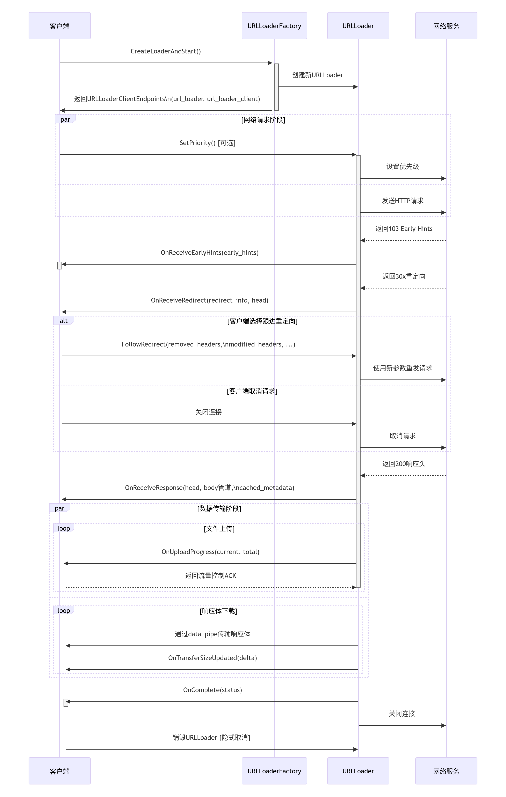

# URLLoader & URLLoaderClient 接口文档

## **接口 URLLoader**

**作用**：执行单次 URL 请求的生命周期管理（创建、重定向、取消）。
**注意**：销毁该对象会自动取消关联请求。

```cpp
interface URLLoader {
  const uint32 kClientDisconnectReason = 1; // 客户端断开连接的错误码（用于服务端日志）

  // 跟随重定向
  FollowRedirect(array<string> removed_headers,
                 network.mojom.HttpRequestHeaders modified_headers,
                 network.mojom.HttpRequestHeaders modified_cors_exempt_headers,
                 url.mojom.Url? new_url);

  // 设置请求优先级
  SetPriority(RequestPriority priority, int32 intra_priority_value);
};
```

### 方法详解

#### 1. `FollowRedirect()`

* **触发条件**：客户端收到 `OnReceiveRedirect()` 后调用。
* **参数作用**：

  * `removed_headers`：需要移除的请求头（如 `["Cookie", "User-Agent"]`）。
  * `modified_headers`：新增/修改的常规请求头（如添加 `Authorization`）。
  * `modified_cors_exempt_headers`：修改 CORS 豁免头（如 `Sec-` 前缀头）。
  * `new_url?`：可选，覆盖重定向 URL（必须同源）。
* **处理顺序**：移除头 → 修改头 → 应用新 URL。

#### 2. `SetPriority()`

* **作用**：动态调整请求优先级（如用户滚动时提升图片加载优先级）。
* **参数说明**：

  * `priority`：优先级枚举（HIGH / LOW）。
  * `intra_priority_value`：同优先级内排序（-1 表示保持原值）。

---

## **接口 URLLoaderClient**

**作用**：接收来自 URLLoader 的异步事件（响应、重定向、进度、完成）。
**注意**：销毁该对象会中断请求。

```cpp
interface URLLoaderClient {
  OnReceiveEarlyHints(EarlyHints early_hints);
  OnReceiveResponse(URLResponseHead head,
                    handle<data_pipe_consumer>? body,
                    mojo_base.mojom.BigBuffer? cached_metadata);
  OnReceiveRedirect(URLRequestRedirectInfo redirect_info, URLResponseHead head);
  OnUploadProgress(int64 current_position, int64 total_size) => ();
  OnTransferSizeUpdated(int32 transfer_size_diff);
  OnComplete(URLLoaderCompletionStatus status);
};
```

### 方法详解

#### 1. `OnReceiveEarlyHints()`

* **触发条件**：收到 `103 Early Hints`（HTTP/2 / HTTP/3）。
* **用途**：预加载资源（CSS/JS）提升页面性能。
* **参数**：`early_hints` 包含 `Link:` 预加载信息。

#### 2. `OnReceiveResponse()`

* **触发条件**：收到完整响应头（最多一次）。
* **参数**：

  * `head`：响应元数据（状态码、类型、缓存策略等）。
  * `body`：响应体数据管道（客户端需主动读取）。
  * `cached_metadata`：可选缓存（如 V8 字节码）。
* **规则**：必须在 `OnComplete()` 前持有 `body`，否则视为取消。

#### 3. `OnReceiveRedirect()`

* **触发条件**：收到重定向响应（如 `302`）。
* **后续**：客户端必须调用 `FollowRedirect()` 或取消请求。
* **参数**：

  * `redirect_info`：重定向详情。
  * `head`：响应头部信息。

#### 4. `OnUploadProgress()`

* **触发条件**：上传进度更新（仅上传时）。
* **特殊语法**：`=> ()` 表示客户端需回复确认，避免阻塞。
* **参数**：

  * `current_position`：已上传字节数。
  * `total_size`：总大小（未知为 -1）。

#### 5. `OnTransferSizeUpdated()`

* **触发条件**：网络传输字节数变化。
* **参数**：`transfer_size_diff` 本次新增字节数（正数）。
* **限制**：仅在启用 `report_raw_headers` 或客户端有权限时触发。

#### 6. `OnComplete()`

* **触发条件**：请求结束（成功 / 失败 / 取消）。
* **规则**：

  * 必须是最后一个事件。
  * 如果有 `body` 管道，服务端写完数据后才触发。
* **参数**：`status` 包含最终状态（错误码、SSL 信息等）。

---

## **结构体 URLLoaderClientEndpoints**

```cpp
struct URLLoaderClientEndpoints {
  pending_remote<URLLoader> url_loader;
  pending_receiver<URLLoaderClient> url_loader_client;
};
```

* **作用**：封装双工通道，连接 `URLLoader`（服务端）与 `URLLoaderClient`（客户端）。
* **典型场景**：

  * `url_loader`：客户端用于控制请求（如 `FollowRedirect()`）。
  * `url_loader_client`：服务端用于推送事件（如 `OnReceiveResponse()`）。

---

## **总结：上下文与流程**

1. **创建请求**

   * 客户端调用 `URLLoaderFactory::CreateLoaderAndStart()` 创建 `URLLoader` 并启动请求。
   * 返回 `URLLoaderClientEndpoints` 用于双向通信。

2. **关键设计**

   * **取消机制**：销毁 `URLLoader` 或 `URLLoaderClient` 会中止请求。
   * **流量控制**：`OnUploadProgress()` 需客户端确认，避免阻塞。
   * **数据管道**：响应体通过 Mojo 数据管道传输，减少内存拷贝。
   * **安全隔离**：`cors_exempt_headers` 允许绕过跨域限制（需权限）。

3. **性能优化**

   * **EarlyHints**：资源预加载。
   * **cached\_metadata**：缓存复用。
   * **SetPriority**：请求优先级动态调整。

---

📌 **该模块是 Chromium 网络栈核心**：负责 HTTP 请求/响应、重定向、数据流与生命周期管理，广泛用于浏览器渲染进程与网络服务通信。

# 流程图：




