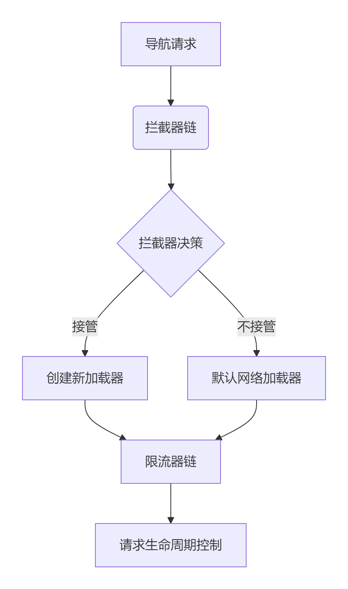
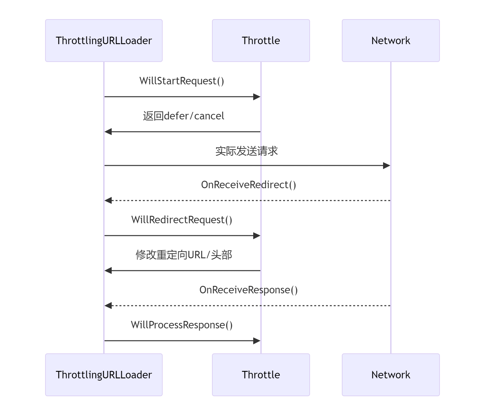
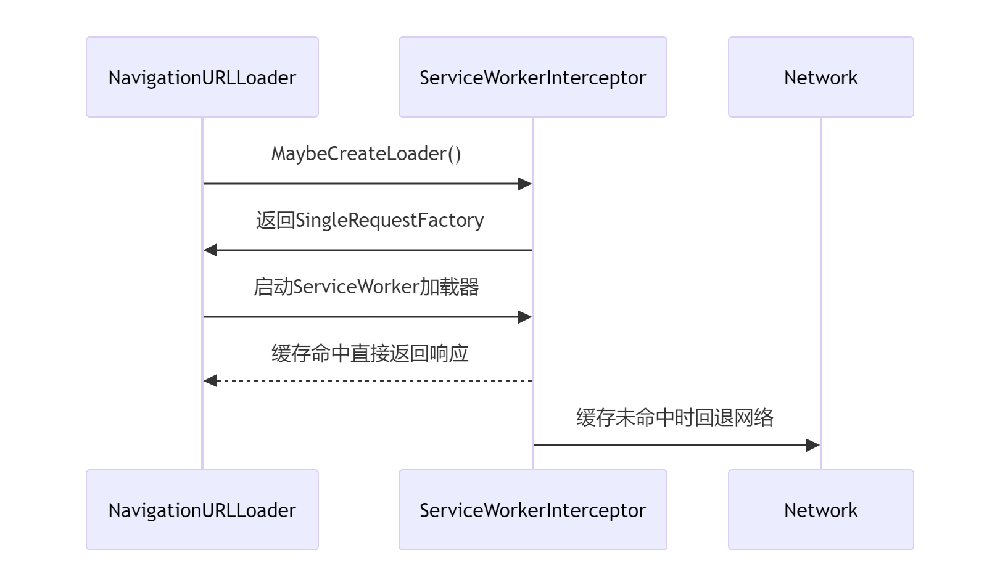

# 拦截器与限流器关系分析

## 核心关系模型



---

## 功能划分

| 组件      | 职责                                  | 关键接口                                                                       |
| ------- | ----------------------------------- | -------------------------------------------------------------------------- |
| **拦截器** | 高层决策<br>• 请求接管<br>• 协议处理<br>• 响应改写  | `MaybeCreateLoader()`<br>`MaybeCreateLoaderForResponse()`                  |
| **限流器** | 细粒度控制<br>• 请求延迟<br>• 头部修改<br>• 错误处理 | `WillStartRequest()`<br>`WillRedirectRequest()`<br>`WillProcessResponse()` |

---

## 执行流程

### 1. 初始化阶段

```cpp
void NavigationURLLoaderImpl::Start() {
  CreateInterceptors();  // 创建拦截器链
  Restart();             // 启动处理流程
}
```

* 按优先级初始化拦截器（ServiceWorker, SignedExchange 等）
* 构建 `interceptors_` 有序集合

---

### 2. 拦截决策流程

```cpp
void MaybeStartLoader(size_t next_index, optional<Result> result) {
  if (result) {
    StartInterceptedRequest(result->factory); // 拦截器接管
  } else if (next_index < interceptors_.size()) {
    interceptors_[next_index]->MaybeCreateLoader(...); // 继续下一个拦截器
  } else {
    StartNonInterceptedRequest(); // 默认网络加载
  }
}
```

* 链式调用拦截器的 `MaybeCreateLoader()`
* Service Worker 可能返回 fallback 回调

---

### 3. 限流器注入

```cpp
void CreateThrottlingLoaderAndStart() {
  auto throttles = CreateURLLoaderThrottles(); // 创建限流器集合
  loader_holder_.SetLoader(
      ThrottlingURLLoader::CreateLoader(throttles...));
}
```

* `CreateURLLoaderThrottles()` 构建限流器集合
* 注入 `ThrottlingURLLoader`

---

### 4. 请求生命周期



---

## 设计思想亮点

### 1. 分层责任机制

* **拦截器（战略级决策）**

  * 协议处理（WebBundle / SignedExchange）
  * 资源替代（Service Worker 缓存）
* **限流器（战术级控制）**

  * 安全策略（CSP 检查）
  * 性能监控（NavigationTimingThrottle）

---

### 2. 双阶段拦截

```cpp
// 请求前拦截
virtual void MaybeCreateLoader(...);

// 响应后拦截
virtual bool MaybeCreateLoaderForResponse(...);
```

* 支持请求前完全接管
* 支持响应后内容改写

---

### 3. 状态机管理

```cpp
class LoaderHolder {
  enum State { kNone, kLoadingViaLoader, kLoadingViaReceiver, kUnbound };
  void ResetForFollowRedirect();
};
```

* 精确控制加载器生命周期
* 处理重定向时的原子操作

---

### 4. 异步协调机制

* **拦截器**：通过 `LoaderCallback` 异步返回决策
* **限流器**：通过 `Delegate::Resume()` 恢复延迟请求

---

## 典型工作场景

### 1. Service Worker 拦截



---

### 2. 签名交换处理

```cpp
void SignedExchangeInterceptor::MaybeCreateLoader(...) {
  if (IsSignedExchange(url)) {
    factory = CreateSignedExchangeLoaderFactory();
    callback.Run(Result(factory)); // 接管请求
  }
}
```

---

### 3. 安全限流控制

```cpp
void CSPThrottle::WillStartRequest(...) {
  if (CheckCSPViolation()) {
    delegate->CancelWithError(net::ERR_BLOCKED_BY_CSP);
  }
}
```

---

## 性能优化设计

1. **工厂缓存机制**

```cpp
scoped_refptr<SharedURLLoaderFactory> GetOrCreateNonNetworkLoaderFactory() {
  if (cached_factory) return cached_factory;
  return CreateNonNetworkLoaderFactory(...);
}
```

2. **头部解析优化**

```cpp
void ParseHeaders(...) {
  if (head->parsed_headers) return;
  GetNetworkService()->ParseHeaders(...);
}
```

3. **Early Hints 预加载**

```cpp
void OnReceiveEarlyHints(EarlyHintsPtr early_hints) {
  early_hints_manager_->HandleEarlyHints(early_hints);
}
```

---

## 错误处理体系

1. **多级取消机制**

```cpp
void CancelWithError(int error, string_view reason) {
  loader_holder_.ResetForFailure();
  delegate_->OnRequestFailed(status);
}
```

2. **重定向安全校验**

```cpp
void OnReceiveRedirect(...) {
  if (!IsSafeRedirectTarget(...)) {
    loader_->CancelWithError(net::ERR_UNSAFE_REDIRECT);
  }
}
```

3. **超时控制**

```cpp
bool SetNavigationTimeout(base::TimeDelta timeout) {
  timeout_timer_.Start(...);
}
```

---

## 总结

Chromium 的导航加载系统通过 **拦截器-限流器双架构** 实现高度可扩展性：

1. **拦截器**：战略层，处理协议路由和资源替代
2. **限流器**：战术层，实施细粒度控制和策略执行
3. **状态机管理**：保证复杂流程（如重定向）的原子性
4. **异步协调**：在灵活性与性能之间取得平衡

这种设计使 Chromium 能支持 **Service Worker、Web Bundles、开发者工具调试** 等高级特性，同时保持核心加载流程的高效与稳定。
